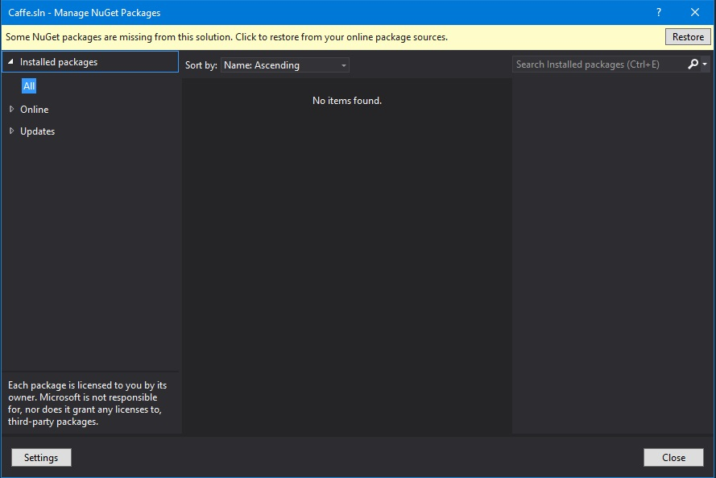

# Research work for Vrinda
<!-- TOC START min:1 max:3 link:true update:true -->
- [Research work for Vrinda](#research-work-for-vrinda)
- [Visual Sentiment-Ontology (VSO)](#visual-sentiment-ontology-vso)
  - [How it works](#how-it-works)
  - [What I was able to get working](#what-i-was-able-to-get-working)
  - [How it performs verses our goals](#how-it-performs-verses-our-goals)
  - [Proposed Next Steps](#proposed-next-steps)
- [Build and Install Directions](#build-and-install-directions)
  - [Sentibank](#sentibank)
    - [Sentibank software:](#sentibank-software)
  - [Nvida Drivers](#nvida-drivers)
  - [Caffe](#caffe)
    - [Dependencies](#dependencies)
    - [Pre-Build Steps](#pre-build-steps)
    - [Build Steps](#build-steps)

<!-- TOC END -->
# Visual Sentiment-Ontology (VSO)
* Home page: http://visual-sentiment-ontology.appspot.com/?
* Research paper: http://www.ee.columbia.edu/ln/dvmm/vso/download/visual_sentiment_ontology_FINAL.pdf

The Visual Sentiment-Ontology (VSO) software was designed to predict sentiment reflected in visual content. To reach this goal they propose a systematic, data-driven methodology to construct a large-scale sentiment ontology built upon
psychology and web crawled folksonomies. As a result they created SentiBank, a concept detector library based on the constructed ontology to establish a novel mid-level representation for bridging the affective gap. Their goal is to construct a large-scale ontology of semantic concepts, which
1. reflect a strong sentiment,
2. have a link to an emotion,
3. are frequently used and
4. have reasonable detection accuracy.

Additionally, the VSO is intended to be comprehensive and diverse enough to cover a broad range of different concept classes such as people, animals, objects, natural or man-made places, and so on.
## How it works
Using emotions from Plutchick's Wheel of Emotions, images and videos were gathered from Flickr and YouTube. Tags from the results were analyzed to pull out nouns, adjectives and verbs. The strong sentiment adjectives and nouns were used to form Adjective Noun Pairs (ANP). Those ANPs were ranked by their frequency on Flickr to form more than 3,000 ANP concepts. Individual detectors were created for each ANP concept and only detectors with reasonable performance were kept to form SentiBank. Their detector library consists of 1,200 ANP concept detectors providing a 1,200 dimension ANP detector response for any given image.

Each of the 1200 detectors use a combination of classifiers including Color Historgram, 512 dimension GIST detector (for landscapes), Local Binary Pattern detector (for textures and faces). Due to the large amount of ANPs in the ontology, Linear SVMs were used to train ANP detectors.

## What I was able to get working
I was able to download their Sentibank software. I ran into some issues getting it to run and build initially, however I have included instructions on how to get it going in the [Build and Install Directions](#build-and-install-directions) section. Assuming python is installed on you PC you can run
```
python sentiBank.py image.jpg
```
and it will return the top 10 ANP Detectors and their ranking.

## How it performs verses our goals
Based on our last email correspondence you were interested in identifying the following from images (both color and black/white).
* Race/Ethnicity (not just as white/ nonwhite but more detailed like Asian, mid-east, south Asian, latino, and AA)
* Gender
* Age
* Attractiveness

I ran a couple images and these are their results from the current SentiBank software. You will notice the accuracy of what is returned varies from photo to photo.

1. 
```
> python sentiBank.py ..\..\old_AA_woman.jpg
image_number: 1 batch_size: 1 iteration: 1
extract_nfeatures caffe_sentibank_train_iter_250000 ..\..\old_AA_woman-test.prototxt fc7,prob ../../old_AA_woman-features_fc7,../../old_AA_woman-features_prob 1 CPU
E0408 17:23:12.995779   200 extract_nfeatures.cpp:64] Using CPU
E0408 17:23:14.051151   200 extract_nfeatures.cpp:134] Extacting Features
E0408 17:23:14.287781   200 extract_nfeatures.cpp:196] Extracted features of 1 query images for feature blob fc7
E0408 17:23:14.287781   200 extract_nfeatures.cpp:196] Extracted features of 1 query images for feature blob prob
E0408 17:23:14.324880   200 extract_nfeatures.cpp:204] Successfully extracted the features!
 Top 10 Sentiments:
nice_guy 0.0152889853343
young_adult 0.0134117435664
weird_face 0.0127914194018
brave_face 0.0109832379967
nice_present 0.00911555904895
bloody_face 0.0084912320599
insane_clown 0.00834089424461
great_smile 0.0080873016268
eager_anticipation 0.00714536849409
bad_hair 0.00666025420651
SentiBank time:  1.74199986458
```
2. 
```
> python sentiBank.py ..\..\old_asian_man.jpg
image_number: 1 batch_size: 1 iteration: 1
extract_nfeatures caffe_sentibank_train_iter_250000 ..\..\old_asian_man-test.prototxt fc7,prob ../../old_asian_man-features_fc7,../../old_asian_man-features_prob 1 CPU
E0408 17:25:17.543287  9800 extract_nfeatures.cpp:64] Using CPU
E0408 17:25:18.603344  9800 extract_nfeatures.cpp:134] Extacting Features
E0408 17:25:18.839473  9800 extract_nfeatures.cpp:196] Extracted features of 1 query images for feature blob fc7
E0408 17:25:18.839973  9800 extract_nfeatures.cpp:196] Extracted features of 1 query images for feature blob prob
E0408 17:25:18.876070  9800 extract_nfeatures.cpp:204] Successfully extracted the features!
 Top 10 Sentiments:
traditional_hat 0.0888161733747
gentle_smile 0.0401889793575
friendly_guy 0.0335352271795
nice_guy 0.0267743505538
smiling_face 0.026158016175
traditional_wedding 0.0205740574747
friendly_smile 0.0197465382516
warm_smile 0.0196362864226
tough_guy 0.0175851676613
bad_teeth 0.0159702021629
SentiBank time:  1.65399980545
```
3. 
```
> python sentiBank.py ..\..\me_man.jpg
image_number: 1 batch_size: 1 iteration: 1
extract_nfeatures caffe_sentibank_train_iter_250000 ..\..\me_man-test.prototxt fc7,prob ../../me_man-features_fc7,../../me_man-features_prob 1 CPU
E0408 17:27:14.398368 13468 extract_nfeatures.cpp:64] Using CPU
E0408 17:27:15.420083 13468 extract_nfeatures.cpp:134] Extacting Features
E0408 17:27:15.685791 13468 extract_nfeatures.cpp:196] Extracted features of 1 query images for feature blob fc7
E0408 17:27:15.686291 13468 extract_nfeatures.cpp:196] Extracted features of 1 query images for feature blob prob
E0408 17:27:15.721385 13468 extract_nfeatures.cpp:204] Successfully extracted the features!
 Top 10 Sentiments:
hot_guy 0.0864497870207
nice_guy 0.0297092255205
young_driver 0.0257720854133
attractive_male 0.0195829253644
tough_guy 0.0177741330117
illegal_drugs 0.0173233710229
sexy_men 0.0162817798555
christian_artist 0.011468376033
smiling_guy 0.0112020066008
proud_father 0.0107944346964
SentiBank time:  1.61800003052
```
4. 
```
> python sentiBank.py ..\..\old_w_woman.jpg
image_number: 1 batch_size: 1 iteration: 1
extract_nfeatures caffe_sentibank_train_iter_250000 ..\..\old_w_woman-test.prototxt fc7,prob ../../old_w_woman-features_fc7,../../old_w_woman-features_prob 1 CPU
E0408 17:28:13.902346 12812 extract_nfeatures.cpp:64] Using CPU
E0408 17:28:14.932582 12812 extract_nfeatures.cpp:134] Extacting Features
E0408 17:28:15.194779 12812 extract_nfeatures.cpp:196] Extracted features of 1 query images for feature blob fc7
E0408 17:28:15.195281 12812 extract_nfeatures.cpp:196] Extracted features of 1 query images for feature blob prob
E0408 17:28:15.230386 12812 extract_nfeatures.cpp:204] Successfully extracted the features!
 Top 10 Sentiments:
great_park 0.0385776907206
shiny_gold 0.0315578877926
lovely_smile 0.0226604174823
outdoor_festival 0.0206459965557
pretty_eyes 0.0188134424388
sunny_morning 0.0149470781907
young_adult 0.0136265736073
great_smile 0.0132393408567
golden_hair 0.0128849716857
peaceful_valley 0.0118683930486
SentiBank time:  1.63800001144
```

As you can see the accuracy of the top 10 ANPs vary based on the random images I selected. They also don't do a great job at identifying gender, attractiveness and age, and don't classify race. However, they do provide a path forward to do so.
## Proposed Next Steps


# Build and Install Directions

## Sentibank

Sentibank is a research project that aims to present a novel approach towards sentiment analysis based on the semantic understanding of visual content. To reseach this goal, we automatically construct a large-scale ontology of semantic concepts, each selected based on the following criteria: (1) reflect a strong sentiment, (2) have a link to an emotion, (3) be frequently used and (4) has reasonable detection accuracy.

### Sentibank software:
http://www.ee.columbia.edu/ln/dvmm/vso/download/SentiBank_detector/
* username: vso
* password sentiworld

This information is provided to: Mr. Andre Martin Cornell University mr.andre.martin@gmail.com
#### Components
* Source code (Matlab): source1.1.zip
* Compiled code (Matlab): binary1.1.zip
* Source code and Compiled code (C++): DeepSentiBank.zip

## Nvida Drivers
http://www.nvidia.com/content/DriverDownload-March2009/confirmation.php?url=/Windows/9.13.1220/PhysX-9.13.1220-SystemSoftware.msi&lang=us&type=Other

This driver package is needed to run the DeepSentiBank code since it has the option of using an Nvidia GPU. Unfortunately it requires installation even if running on a CPU.

## Caffe
Home page: http://caffe.berkeleyvision.org/
Download page: https://github.com/BVLC/caffe
Version used: https://github.com/microsoft/caffe

### Dependencies
#### Protobuf - Protoc
Home page: https://developers.google.com/protocol-buffers/
Download page: http://repo1.maven.org/maven2/com/google/protobuf/protoc/2.6.1/  
Version used:   protoc-2.6.1-windows-x86_64.exe  

#### Microsoft Visual Studio 2013
  * https://www.visualstudio.com/en-us/news/releasenotes/vs2013-community-vs

#### Update Patch
This patch will setup the Caffe source code to be capable of building.
* updates.zip

### Pre-Build Steps
Follow these steps to update the downloaded source code.
```  
mkdir caffe
upzip caffe-master.zip to caffe/win-caffe
unzip updates.zip to caffe/update
run update/update.cmd
```

### Build Steps
Follow the following steps to build the extract_nfeatures.exe binary needed for Sentibank.
* Open Microsoft Visual Studio 2013.
* In Microsoft Visual Studio 2013, open caffe\win-caffe\caffe-master\windows\Caffe.sln.
* Right click on "Solution 'Caffe' (17 projects)" and click on click on "Manage NuGet Packages for Solution"
* 
* In the pop up windown click "Restore". This will download all the necessary dependencies.
* 
* Once complete click Close
* Change the Solution Configuration from Debug to Release.
* * 
* Right click on "Solution 'Caffe' (17 projects)" and click on click on "Build Solution"
* * 
* When the build completes you should see the following in the Output window
  * ========== Build: 17 succeeded, 0 failed, 0 up-to-date, 0 skipped ==========
* Copy the extract_nfeatures.exe binary from  \win-caffe\caffe-master\Build\x64\Release to the DeepSentiBank folder
